# Scoring Pipeline Deployment Introduction

## Outline
- [Objective](#objective)
- [Prerequisites](#prerequisites)
- [Task 1: Tour of Prebuilt Experiment](#task-1-tour-of-prebuilt-experiment)
- [Task 2: Scoring Pipeline Deployment Concepts](#task-2-scoring-pipeline-deployment-concepts)
- [Task 3: Batch Scoring via Score Another Dataset](#task-3-batch-scoring-via-score-another-dataset)
- [Task 4: Interactive Scoring (REST) via Deployment Templates](#task-4-interactive-scoring-rest-via-deployment-templates)
- [Task 5: Challenge](#task-5-challenge)
- [Next Steps](#next-steps)
- [Appendix A: Build Driverless AI Experiment](#appendix-a-build-driverless-ai-experiment)
- [Appendix B: Interactive Scoring (AWS Lambda) via Deployment Templates](#appendix-b-interactive-scoring-aws-lambda-via-deployment-templates)
- [Appendix C: AI Glossary](#appendix-c-ai-glossary)

## Objective

**Machine Learning Model Deployment** is the process of making your models available in production environments, so they can be used to make predictions for other software systems [1]. Before model deployment, **feature engineering** occurs in the form of data preparation that later on will be used to train a model [2]. Driverless AI **Automatic Machine Learning (AutoML)** combines the best feature engineering and one or more **machine learning models** into a scoring pipeline [3][4]. The **scoring pipeline** is used to score or predict data when given new test data [5]. The scoring pipeline comes in two flavors. The first scoring pipeline is a **Model Object Optimized(MOJO) Scoring Pipeline**, a standalone low-latency model object designed to be easily embeddable in production environments. The second scoring pipeline is a Python Scoring Pipeline, which has a heavy footprint that is all Python and uses the latest libraries of Driverless AI to allow for executing custom scoring recipes[6].

 
    </img>    
    
Figure 1: Hydraulic System Cylinder Diagram

By the end of this self-paced course, you will predict the **cooling condition** for a **Hydraulic System Test Rig** by deploying a **MOJO Scoring Pipeline** into production using **Driverless AI**. The Hydraulic System Test Rig data comes from the **[UCI Machine Learning Repository: Condition Monitoring of Hydraulic Systems Data Set](https://archive.ics.uci.edu/ml/datasets/Condition+monitoring+of+hydraulic+systems#)**. Hydraulic System Test Rigs are used to test components in Aircraft Equipment, Ministry of Defense, Automotive Applications, and more [7]. 

-------
This Hydraulic Test Rig can test a range of flow rates that can achieve different pressures with the ability to heat and cool to simulate testing under different conditions[8]. Testing the pressure, volume flow, and temperature is possible by Hydraulic Test Rig sensors and digital displays. The display panel alerts the user when certain testing criteria are met, displaying either a green/red light [8]. In addition, a filter blockage panel indicator is integrated into the panel to ensure the Hydraulic Test Rig’s oil is maintained [8]. The cooling filtration solution is designed to minimize power consumption and expand the life of the Hydraulic Test Rig. For this self-paced course, we are predicting the cooling conditions for Hydraulic System Predictive Maintenance. When the cooling condition is low, our prediction (will) tells us that the cooling of the Hydraulic System is close to total failure, and we may need to look into replacing the cooling filtration solution soon.

The Hydraulic System consists of a primary and secondary cooling filtration circuit with pumps that deliver flow and pressure to the oil tank. The oil tank box at the bottom. There is a pressure relief control valve for controlling the rising and falling flows. In addition, there is a pressure gauge for measuring the pressure. 

-------

### Deep Dive and Resources

- [1] H2O.ai Community AI Glossary: [Machine Learning Model Deployment](https://www.h2o.ai/community/glossary/machine-learning-model-deployment-productionization-productionizing-machine-learning-models)
- [2] H2O.ai Community AI Glossary: [Feature Engineering](https://www.h2o.ai/community/glossary/feature-engineering-data-transformation)
- [3] H2O.ai Community AI Glossary: [Automatic Machine Learning (AutoML)](https://www.h2o.ai/community/glossary/automatic-machine-learning-automl)
- [4] H2O.ai Community AI Glossary: [Machine Learning Model](https://www.h2o.ai/community/glossary/machine-learning-model)
- [5] H2O.ai Community AI Glossary: [Scoring Pipeline](https://www.h2o.ai/community/glossary/scoring-pipeline)
- [6] H2O.ai Community AI Glossary: [Model Object, Optimized (MOJO) Scoring Pipeline](https://www.h2o.ai/community/glossary/model-object-optimized-mojo)
- [7] [SAVERY - HYDRAULIC TEST RIGS AND BENCHES](https://www.savery.co.uk/systems/test-benches)
- [8] [HYDROTECHNIK - Flow and Temperature Testing Components](https://www.hydrotechnik.co.uk/flow-and-temperature-hydraulic-test-bed)

## Prerequisites

You will need the following to be able to do this self-paced course:

- A **Two-Hour Test Drive session**: Test Drive is H2O.ai's Driverless AI on the AWS Cloud. No need to download software. Explore all the features and benefits of the H2O Automatic Learning Platform.
    - Need a **Two-Hour Test Drive** session? Follow the instructions on [this quick self-paced course](https://training.h2o.ai/products/self-paced-course-0-getting-started-with-driverless-ai-test-drive) to get a Test Drive session started.
- Basic knowledge of Driverless AI or completion of the following self-paced course: [Automatic Machine Learning Introduction with Driverless AI Test Drive](https://training.h2o.ai/products/self-paced course-1a-automatic-machine-learning-introduction-with-driverless-ai).
- For Non-AWS Lambda Deployment, we will use a REST Server built into Driverless AI to show how a REST API / Micro service deployment works
- Needed for AWS Lambda Deployment (Optional)
    - If you have an Amazon Admin, request access permissions for:
        - Amazon AWS with IAM Full Access
        - Amazon AWS with AWS Lambda Full Access
        - Amazon AWS with Amazon API Gateway Administrator
        - Amazon AWS with Usage Plans Enabled
    - Create an Amazon AWS IAM Access Key and Secret Key

**Note: Aquarium’s Driverless AI Test Drive lab has a license key built-in, so you don’t need to request one to use it. Each Driverless AI Test Drive instance will be available to you for two hours, after which it will terminate. No work will be saved. If you need more time to further explore Driverless AI, you can always launch another Test Drive instance or reach out to our sales team via the [contact us form](https://www.h2o.ai/company/contact/).**

## Task 1: Tour of Prebuilt Experiment

Let’s discuss the different Driverless AI experiments you could build with the Hydraulic System data and each particular label, which include cooler condition, valve condition, pump leakage, accumulator gas leakage, and stable flag [1]. For each experiment we could build, Driverless AI would choose a classification scorer because each label has 2 or more categories.

**Experiment 1**: Build an Experiment for Hydraulic Cooling Condition Classification

Suppose we chose to do an experiment with the Hydraulic System data and the cooler condition label. In that case, Driverless AI will build a classification experiment that classifies the probability of the cooler condition of 3, 20, or 100 [1]. As a result, we can predict the Hydraulic Cooler is operating close to total failure, reduced efficiency, or full efficiency [1].

| Hydraulic Cooling Condition | Description |
|:--:|:--:|
| 3 | operates at close to total failure |
| 20 | operates at reduced efficiency |
| 100 | operates at full efficiency |

**Experiment 2**: Build an Experiment for Hydraulic Valve Condition Classification

If we were to build an experiment using the Hydraulic System data with the valve condition label, we would be able to predict the Hydraulic valve condition is 100, 90, 80, or 73 [1]. The valve condition classification can tell us the valve operates at optimal switching behavior, with a small lag, severe lag, or close to total failure [1].

| Hydraulic Valve Condition | Description |
|:--:|:--:|
| 100 | operates at optimal switching behavior |
| 90 | operates with a small lag |
| 80 | operates with a severe lag |
| 73 | operates at close to total failure |

**Experiment 3**: Build an Experiment for Hydraulic Internal Pump Leakage Classification

If we build an experiment using the Hydraulic System data with the internal pump leakage label, we would predict if the Hydraulic internal pump leakage is 0, 1, or 2 [1]. Thus, the internal pump leakage classification can tell us the internal pump has no leakage, weak leakage, or severe leakage [1].

| Hydraulic Internal Pump Leakage | Description |
|:--:|:--:|
| 0 | internal pump has no leakage |
| 1 | internal pump has weak leakage |
| 2 | internal pump has severe leakage |

**Experiment 4**: Build an Experiment for Hydraulic Accumulator Gas Leakage Classification

If we were to build an experiment with the Hydraulic System data with the Hydraulic accumulator label, we predict if the accumulator is 130, 115, 100, or 90 [1]. This classification can tell us the Hydraulic accumulator functions at optimal pressure, slightly reduced pressure, severely reduced pressure, or close to total failure [1].

| Hydraulic Accumulator Gas Leakage | Description |
|:--:|:--:|
| 130 | functions at optimal pressure |
| 115 | functions at slightly reduced pressure |
| 100 | functions at severly reduced pressure |
| 90 | functions at close to total failure |

**Experiment 5**: Build an Experiment for Hydraulic Stable Flag Classification

The final experiment we could build is with the Hydraulic System data and the stable flag label. We would be able to predict the Hydraulic stable flag is 0 or 1 [1]. So, our binomial classification can tell us the Hydraulic System conditions were stable or static conditions might not have been reached yet [1].

| Hydraulic Stable Flag | Description |
|:--:|:--:|
| 0 | conditions were stable |
| 1 | static conditions might not have been reached yet |

1\. In Driverless AI, click on the **Experiments** tab. Then click on experiment name **Model_Deploy...**:

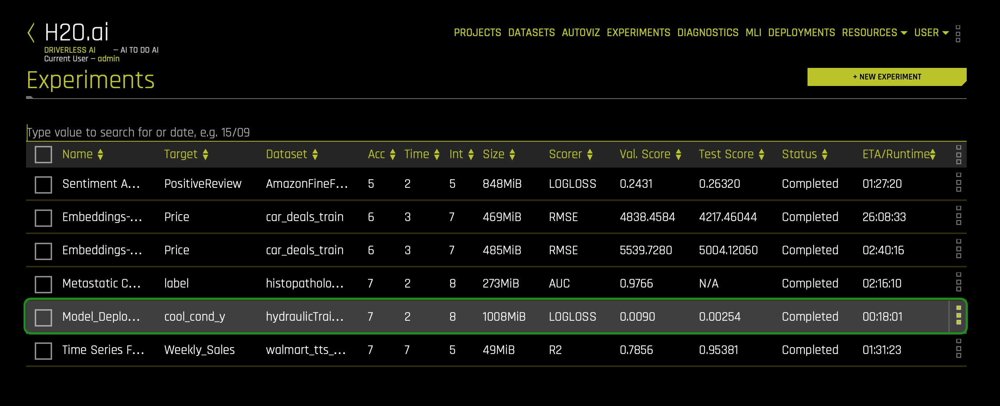

**Figure 2:** Driverless AI Experiments

2\. View the **Experiment Dashboard** for Hydraulic Cooling Condition Classification

In [Appendix A: Build Driverless AI Experiment](#appendix-a-build-driverless-ai-experiment), you will find steps that will walk you through the process of how to build the experiment using the Hydraulic System data and the cooler condition label. What you will see is the dataset was split as follows:

- 75% for training
- 25% for testing data

The experiment was built using the training data with the cooling condition as the label. The testing data was used to evaluate the scorer.

2\. For Machine Learning Model Deployment, let’s examine the **status menu** options, **summary**, **loss function result**, and **variable importance**.

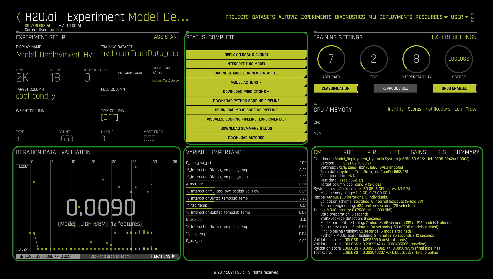

**Figure 3:** Experiment Dashboard for Hydraulic System Cooling Condition

We can use Driverless AI’s **Deploy (Local & Cloud)**, **Download Python Scoring Pipeline**, or **Download MOJO Scoring Pipeline** features to deploy the model. The Deploy (Local & Cloud) allows users to auto-deploy their model to a REST server or an Amazon Lambda. On the other hand, the Download Python Scoring Pipeline or Download MOJO Scoring Pipeline is more hands-on. The user can choose to go with the embedded deployment approach or server deployment approach for the model. Since the Driverless AI MOJO Scoring Pipelines are small in size, they can be easily embedded on edge devices with a low memory footprint. However, the Driverless AI Python Scoring Pipelines are bulkier in size, so they should be embedded on devices with a high memory footprint.

If you want to practice batch scoring data right away with Driverless AI, you should use the built-in **Predict** feature under **Model Actions**. When you click on this button, you can choose your test data and the label you are predicting; then, Driverless AI will execute the Python Scoring Pipeline behind the scenes to do batch scoring. This is a great way to use the UI to test the model with different datasets interactively while the model is being built and inspected by a data scientist. However, in production, a standalone model might be used; see our follow-up self-paced courses on model deployment to learn more. 

In the summary section, we can see our model's max memory usage, feature engineering, MOJO latency, etc. These metrics are areas we should consider when deploying our models to certain environments. For instance, does the environment support the scorer’s memory usage? Does MOJO latency change much when we embed it on a low memory footprint device? 

After the experiment is built, the dashboard shows our model’s loss function result for the validation and test scores. We can also see **LightGBM** is the classification model trained based on **16 features** for predicting the hydraulic cooling condition. In the experiment dashboard, we can see Log Loss is the model’s loss function. The **validation score’s logloss is 0.0091 (final pipeline)**. Likewise, the **test score’s logloss is 0.0025 (final pipeline)**. The logloss result tells us how good or bad the model makes predictions. Since our loss is very low near 0, our LightGBM model is very close to correctly assigning probabilities for each category it is classifying from the test data.

The **variable importance** tells us which features were considered important when the model was being trained. We can see the list is ordered from most to least important. At the top is **cool_pwr_pct**, and this feature is expected to be high in importance because the Hydraulic cooling condition needs the power to function at full efficiency. It looks like **tsc_temp** and **tsb_temp** are also important for the Hydraulic cooling condition, and that makes sense because the temperature can significantly impact the Hydraulic cooler’s efficiency. If the temperature is high, that could be a sign there is a problem with the Hydraulic cooler. The variable importance shows what variables are most crucial when the model is predicting the Hydraulic cooling conditions.

3\. In the Driverless AI dashboard, let’s change from the summary view to the **P-R metrics view**. 

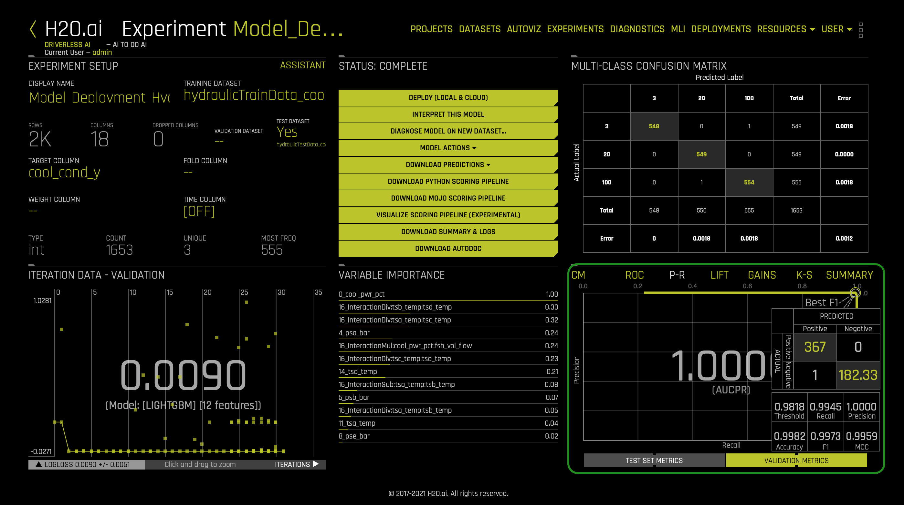

**Figure 4:** Experiment PR Metrics for Hydraulic System Cooling Condition

These metrics are used to evaluate the quality of the multinomial classification model that was built. By clicking on the dot in the top right corner of the graph, we can see the following best values for our scorer:

- **Recall** is 0.9945
- **Precision** is 1.0000
- **F1** is 0.9973
- **MCC** is 0.9959

**Recall** is a measure of completeness or quantity of the results obtained by the model [2]. It is the ratio of the number of predictions divided by all the actual labels [2]. For example, let’s say the number of predictions for the hydraulic cooling condition operating at reduced efficiency occurs 30% of the time, but there are 40% actual labels, then the recall is ¾. In the Driverless AI dashboard, we see the **recall is 99.45%**, which means the quantity of the results obtained by the model is nearly complete.

**Precision** is a measure of exactness or quality of the results obtained by the model [2]. It is the ratio of the correct predictions divided by the total number of predictions. This ratio is measured from 0.0 to 1.0, with 0.0 being the worst and 1.0 being the best precision [2]. For example, let’s say the number of predictions for hydraulic cooling condition operating at full efficiency with the actual labels matching is 40% of the time, and the total number of predictions for the hydraulic cooling condition is operating at full efficiency without the actual labels matching is 50% of the time, then the precision is ⅘. In the Driverless AI dashboard, we see the **precision is 100.00%**, which means the exactness and quality of the results obtained by the model has the best precision.

**F1** represents the **Harmonic Average** of the recall and precision [2]. F1 is measured in the range of 0 to 1, with 0 meaning there are no true positives and 1 meaning there are neither false negatives nor false positives [2]. The **F1 is 99.73%** in the Driverless AI dashboard, which means our model is near perfect on precision and recall.

**MCC** stands for **Matthew Correlation Coefficient** and is a measure of the quality of the classifications [2]. MCC is measured in the range between -1 and +1, with +1 being a perfect prediction and 0 being no better than a random prediction, and -1 being incorrect predictions [2]. The **MCC is 99.59%** in the Driverless AI dashboard, meaning our model performs nearly perfect predictions.

### Deep Dive and Resources

- [1] [Condition monitoring of hydraulic systems Data Set](https://archive.ics.uci.edu/ml/datasets/Condition+monitoring+of+hydraulic+systems#)
- [2] [Machine Learning Experiment Scoring and Analysis: Task 3 Concepts](https://training.h2o.ai/products/self-paced-course-1b-machine-learning-experiment-scoring-and-analysis-financial-focus)

## Task 2: Scoring Pipeline Deployment Concepts

### Machine Learning Workflow

**Figure 5:** Machine Learning Workflow

The **Machine Learning Model Deployment** workflow includes data preprocessing, model training, model deployment, and model predicting. During data preprocessing, the training data is collected, explored, and prepared for training the model. 

During **Model Training**, **Machine Learning Algorithms** are tuned via hyperparameters, and features are used to train the Machine Learning Algorithm. A Machine Learning Algorithm is a programmed algorithm that receives and analyzes input data to predict output values within an acceptable range [1]. This trained Machine Learning Algorithm then gets saved as a **Machine Learning Model**. A Machine Learning Model is the output generated when you train your Machine Learning Algorithm with your training data [2]. Once the Model is saved, one typically evaluates their Model with a validation data set that comes from a small percentage of the training data. Model explanation and the model report explain why the Model Algorithm was chosen and provides a score, such as **root mean squared error (RMSE)** to defend choosing the Model Algorithm for its high accuracy. A low RMSE means we have a good Model.

During **Model Deployment**, **Model Management & Monitoring** is used for **model reproducibility** and **model versioning**. When you notice the model does not perform the way you expect after monitoring it for some time, you will typically go back into the phase where we train the Machine Learning Algorithm and potentially even go back to the feature engineering. You will repeat this process: train the Machine Learning Algorithm and save the Machine Learning Model until you obtain the most accurate model. Model Engineering is the process we just described above. Now that we have engineered our model, we can deploy it into production on-premise or in the cloud to make predictions on real-world data.

During **Model Predicting**, the model is running, and we can pass real-world data to them to make predictions for one or more labels. Some examples of what these models can be used for include: credit risk scoring to personalize credit decisions, anti-money laundering to stop crime, anomaly detection to find network anomalies, predicting ICU transfers to save lives by catching patients before they crash, and condition monitoring for hydraulic systems to predict points of failure in the system [3].

### From Model Training to Production Deployment to Edge

**Figure 6:** Model Training to Model Deployment to Scoring

Productionizing a machine learning model involves **model training**, **model deployment**, and **scoring**. Data is loaded into the ML platform during model training, and then AutoML is executed to generate the winning machine learning model. In the case of H2O Driverless AI, AutoML generates a scoring pipeline, which consists of the feature engineering and winning machine learning model. During model deployment, the scoring pipeline is deployed on-premise or in the cloud, and machine learning management is executed to monitor the performance of the scoring pipeline. During scoring, the scoring pipeline’s functions can be accessed from the edge and IoT devices directly or through remote procedure calls to make predictions on one or more labels.

### Model Object, Optimized (MOJO)

**Figure 7:** Driverless AI MOJO Diagram

The **MOJO (Model Object Optimized)** is small in size and very fast at real-time computing predictions and batch predictions. So, whether you are making predictions on edge or up in the cloud, the MOJO can run practically anywhere. When you build an experiment in Driverless AI, you have the option to download a MOJO scoring pipeline. The MOJO scoring pipeline is packaged with the winning feature engineering and machine learning models such as XGBoost, LightGBM, GLM, Decision Tree, TensorFlow, FTRL, etc. The Driverless AI MOJO can be executed in Java Runtime and C++ Runtime. To execute the Driverless AI MOJO scoring pipeline in either runtime, one must have a Driverless AI License Key.

### MOJO and Python Scoring Pipelines

Scoring in machine learning is also called prediction or prediction. Scoring is the process of generating values (or scores, predictions) using a trained machine learning model [5]. A scoring pipeline is a unique technology that deploys all feature engineering and the winning machine learning model in a highly optimized, low-latency, production-ready Java code that can be deployed anywhere [6]. Driverless AI has this focus on feature engineering and not just building a model. Driverless AI builds a feature engineering pipeline to create better features for the model to find signals from in your data. Executing the scoring pipeline is the practice of scoring data. In Driverless AI, there are two types of scoring pipelines: MOJO scoring pipelines and a Python scoring pipeline [7].

The **MOJO Scoring Pipeline** is a lightweight and low-latency scoring engine that can be executed in any Java Runtime or C++ Runtime to score data in real-time [8]. You can give it one row at a time and make a prediction. It is very embeddable; you can wrap a service around it or embed it inside your application. For the Java runtime, Java, PySparkling, and Sparkling Water are provided [8]. For the C++ runtime, both Python and R wrappers are provided [9].

The **Python Scoring Pipeline** is a heavy footprint that is all Python and uses the latest libraries of Driverless AI, including the Python H2O4GPU module [12]. It is a scoring engine available for experiments and/or interpreted models to score data [7]. It is suitable for batch applications. In addition, it is used as a reference application for testing that the MOJOs are giving the right answers [12]. Usually, the Python Scoring Pipeline will have new features of Driverless AI before the MOJO since most packages pulled into the feature engineering product part of Driverless AI are implemented in Python [12]. Then the MOJO will work to implement those same features into the MOJO for their real-time scoring applications [12].

The **MLI Python Scoring Pipeline** contains an exported model and Python 3.6 source code examples for productionizing models built using Driverless AI **Machine Learning Interpretability (MLI) tool** [19]. **MLI** is used to explain machine learning model results in a human-readable form through different techniques and methodologies [20]. This scoring engine is only available for interpreted models and allows you to obtain reason codes for a given row of data [19]. 

### How To Choose a Scoring Pipeline Deployment

| Questions for Organization | Embedded Java MOJO Scoring Pipeline Deployment | Embedded C++ MOJO Scoring Pipeline Deployment | Embedded Python Scoring Pipeline Deployment | Scoring Pipeline Server Deployment |
|:------------:|:------------:|:------------:|:------------:|:------------:|
| Supported Environments | x86-64 Linux, IBM PowerPC, Mac OS X | x86-64 Linux, IBM PowerPC, Mac OS X | x86-64 Linux | x86-64 Linux, IBM PowerPC, Mac OS X, Windows |
| Which Programming Language? | Java, Scala, Python | C++, Python, R | Python | Ruby, Python, Perl, C, C++, C#, Cocoa, D, Dart, Delphi, Go, Haxe, Java, PHP, JavaScript, Node.js, Lua, Smalltalk |
| Does your model require real-time scoring? | low latency real-time scoring | low latency real-time scoring | slow real-time scoring | real-time scoring |
| Does your model require batch scoring? | low latency batch scoring | low latency batch scoring | slow batch scoring | batch scoring |
| Do you require embedded scoring? | MOJO2 Java Runtime API | MOJO2 C++ Runtime Python Wrapper or R Wrapper API | Python Runtime API | |
| Do you require client/server scoring via HTTP or TCP? | Need to create client/server scoring service via HTTP, TCP or REST API | Need to create client/server scoring service via HTTP, TCP or REST API | Need to create client/server scoring service via HTTP, TCP or REST API | Supports client/server scoring via HTTP,TCP or REST protocols |
| Does your model have TensorFlow or NLP feature engineering? | | TensorFlow, NLP feature engineering | TensorFlow, NLP feature engineering | It depends on the Server’s Scoring Pipeline |
| Does your model require GPUs? | | | support for GPUs | It depends on the Server’s Scoring Pipeline |
| Does your model use RuleFit, FTRL or any custom recipes? | | | RuleFit, FTRL, custom recipes | It depends on the Server’s Scoring Pipeline |
| Does the model change frequently? Let’s say it changes each month. | API code change and testing might be required | API code change and testing might be required | API code change and testing might be required | Web Service Call |

### Productionizing Scoring Pipelines

There are various options for deploying scoring pipelines into production. You can think of deployment as a method of executing the scoring pipeline. For the MOJO Scoring Pipeline in Java Runtime, the Driverless AI GUI Deploy feature and Driverless AI Deployment Templates are methods to execute the scoring pipeline. There is the scoring service for the Python Scoring Pipeline, which is a method to execute the scoring pipeline [10]. For the MOJO Scoring Pipeline in C++ Runtime, you could leverage the existing Driverless AI Deployment Templates and create your own deployment templates.

The **MOJO Scoring Pipeline in Java Runtime** can be deployed into production using the Driverless AI GUI Deploy button or Driverless AI Deployment Templates. The GUI Deploy button makes it easy to execute the MOJO scoring pipeline onto a REST server powered by the Java SpringBoot framework and/or an Amazon Lambda function [11]. Alternatively, the Driverless AI Deployment Templates provides various templates for executing the MOJO scoring pipeline in different production environments including on a remote REST server powered by the Java SpringBoot framework, Amazon Lambda function, Google Cloud Run, and SQL database [11]. The Driverless AI Deployment Templates local REST scorer and Amazon Lambda scorer are used as the basis for the deployment from Driverless AI. The actual practice of starting the scorer from Driverless AI is handled by Driverless AI instead of the Driverless AI Deployment Templates where the user starts the scorer and has more control. Once the MOJO scoring pipeline is deployed, send an HTTP request to use the MOJO to score data.

The **MOJO Scoring Pipeline in C++ Runtime** can be deployed into production using your own custom deployment templates. For example, you could reference the existing local REST scorer Driverless AI Deployment Template to build your own local REST scorer template in Python or R. Similarly, you could also reference the Python scoring service to build your own version using the Python or R wrapper. Both of these approaches are typically implemented as a client and server architecture.

The **Python Scoring Pipeline** and the **MLI Python Scoring Pipeline** can be deployed into production using the scoring service [10]. The scoring service is typically implemented as a client and server architecture. The scoring service hosts the Python scoring module as an HTTP or TCP service [10]. As a result, all the functions of the scoring module are exposed through remote procedure calls (RPC). This mechanism allows you to invoke scoring functions from languages other than Python on the same computer or another computer on a shared network or the internet. The scoring service can be started in two ways: HTTP mode and TCP mode [10]. In HTTP mode, the scoring service provides JSON-RPC 2.0 calls served by Tornado, and in TCP mode, the scoring service provides high-performance RPC calls served by Apache Thrift using binary wire protocol [10]. The TCP mode allows you to use the scoring service from any language supported by Thrift, including C, C++, C#, Cocoa, D, Dart, Delphi, Go, Haxe, Java, Scala, Node.js, Lua, Perl, Python, Ruby, and Smalltalk. The HTTP model is usually less performant than Thrift but has the advantage of being usable from any HTTP client library in your language of choice without dependency on Thrift. Once the scoring service is started, your Python scoring pipeline is deployed, you can score data using Python directly, the HTTP web client, or the TCP thrift client. Alternatively, you can obtain reason codes for a given row of data if you deployed the MLI scoring pipeline.

### Challenges of Productionizing Scoring Pipelines

At this stage, the organization has already built their model(s) that deliver high accuracy and does not overfit. However, they have not obtained any economic value from the scoring pipeline because it is not used in production making decisions. For many organizations, deploying the scoring pipeline into production is challenging because there are many paths and questions that must be considered. So to help the organization find their path to model deployment, we have “The Four Pillars of ML Model Deployment.” These pillars include points to think about as we move toward deploying our scoring pipeline into production.

**Figure 8:** The Four Pillars of ML Model Deployment

#### Data Sources and Their Format

This section will discuss the data sources and their format for the situation when the model is deployed into production.

**Figure 9:** Data Sources Diagram

In production, after the model calculates the predictions, will the same data with the same structure (also known as schema) be available [13]? **No, because the model will predict one or more labels from the real-world data and return the predicted data.** Considering supervised learning, if we think back to the training data, the training data had data and one or more labels, which we used to train, validate and test the model to predict the label(s). When the model is deployed into production, it deals with real-world data in which it must predict one or more labels that are not included. As a result, the prediction will consist of only the predicted labels. For example, with monitoring the condition of Hydraulic Systems, we are interested in using a model to predict the label for the cooling condition. When the model makes the prediction, it returns the cooling condition and not the original test data.

#### How to Measure Success

**Figure 10:** Measure Success Diagram

To measure model success, we must translate to a business, do model testing, address model decay, do model staging, model monitoring, and monitor the resource usage. For the economic value the models bring to the business, we must be able to tell the non-technical consumer that the models were built in a formalized way using standard metrics to meet their expectations [13]. For model testing, it is critical to choose the appropriate models and data set splits based on the discussion with the business, the nature of the data set, and other inputs [13]. Once the model is in production, several key performance indicators (KPIs) must be met. For instance, IoT and edge devices will most likely require models to be small in size and predictions to be computationally inexpensive due to limited memory and possibly battery life [13].

For addressing model decay, it is about being aware that our model will become obsolete and need to be replaced. So, there are questions to help us determine the answers, such as how fast do models decay and how much is the cost to retrain and redeploy the new model into production [13]? For model staging, it involves testing a model in a production-like environment before being set live. So, we must test model quality in the testing phase as well as possible. Some of the tests in the staging area include passing automated user tests, integration tests, manual tests, and acceptance user tests [13]. Then from the results of the testing, we can determine whether we have built a model efficient enough to replace the current one in production.

For model monitoring, we do it to ensure the model keeps performing well in production. When monitoring the model, we should ask ourselves common questions, such as if the data patterns and data values change that were used to train the model, how does that impact the results inferred by the model? If other KPIs fall outside the expected range, then keep a backup older model to fall back to or keep some backup system. When monitoring the model’s resource usage, it is highly variable and use-case specific [13]. Also, if the model consumption increases, the operations team should act to increase the resource pool. As a result, this increase in the resource pool prevents a performance drop due to the lack of resources.

#### Bringing The Model to Production

**Figure 11:** Model to Production Diagram

To bring the model into production, we must consider a multi-tenant environment, high availability, versioning, and integration of the model. With a multi-tenant environment, enterprises serve multiple customers on a single software platform and infrastructure. While some customers may benefit from using a common scoring pipeline trained on a joined data set, others will obtain inaccurate results [13]. In addition, the scoring pipeline service needs to be available at a specified time. So, considering the high availability of the scoring service with low latency is important. With high availability, there are a certain number of “9’s” of availability from our scoring service deployment. For instance, five "nines" or "99.999%" means 5 minutes 15 seconds or less of downtime in the year, while four nines or 99.99% means 52 minutes 36 seconds of downtime per year [14]. If we look at the four nines example, you can do your service level agreement (SLA) for 8.65 seconds in a day, even during peak traffic hours [14].
 
Next, we must look at model versioning, which is keeping old models archived and versioned. This process involves documenting underlying logic at any moment in the past, storing the plain model along with the metadata for the parameters and structure of the model with production metrics, and rolling back to the last correct version of the model if there was a flaw [13]. Finally, we must consider integrating the scoring pipeline, which involves integrating the scoring pipeline into different production environments. We should do proper planning of the integration to prevent the productionization of the scoring pipeline from taking a long time [13]. We must make sure their scoring pipeline is agile to carry out a number of deployment options. The scoring pipeline must be independent of a particular server-like architecture, meaning it should be self-contained to be used in a variety of production environments [13]. The scoring pipeline should have the flexibility of being deployed in the cloud or being embedded on-premise.

#### External Limitations and Restrictions

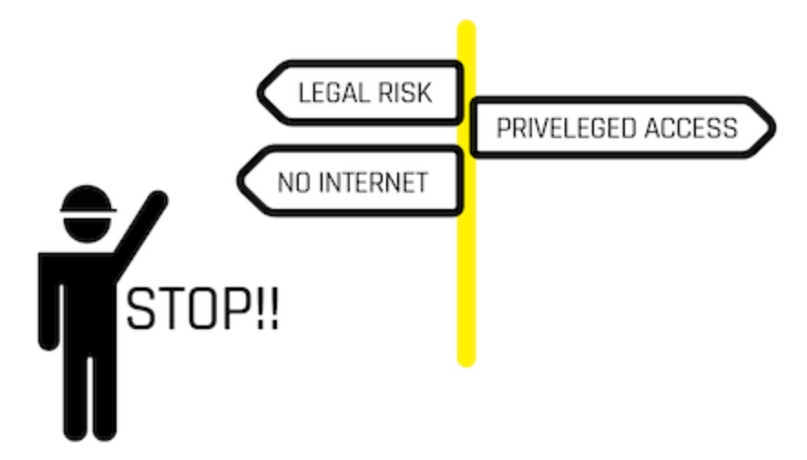

**Figure 12:** External Limits Restrictions Diagram

For external limitations and restrictions, we will look at how privileged access, hermetic environment and legal limitation impact our scoring pipeline deployment. An external limitation you may discover when running or setting up your scoring pipeline runtime is that privileged access is needed [13]. Potential problems to consider are finding a solution that takes too long, or it is unsolvable. In addition, if we access sensitive data, it may require being in a closed hermetic environment without an internet connection [13]. So, model deployment requiring an internet connection may not be available, and deadlines may be missed trying to resolve the issue. Another problem that can come up is a legal limitation. So, throughout the inception discussion, legal departments should be involved to mitigate risks of using ML methods that are not available due to regulatory reasons [13].

### Making Decisions Based on a Good Model

The purpose of the model scorer’s loss function is to calculate how good or bad the predicted probabilities are [15]. For bad predictions, the loss function returns high values [15]. For good predictions, the loss function returns low values [15]. In the self-paced course, when you build the experiment using the Hydraulic System data with the cooling condition label, Driverless AI will most likely choose the log loss function for our scorer. The purpose of **log loss** is to measure the performance of a binomial or multinomial classification model [16] [17]. Log loss in H2O evaluates how close a model’s predicted values are to the actual target value [17]. The goal of our model is to minimize the log loss value so our predicted probability stays as close to the actual label as possible. The H2O algorithms don’t just predict a category; they give a probability for each category's answer [18]. In Driverless AI, after the experiment has launched, it displays the log loss value:

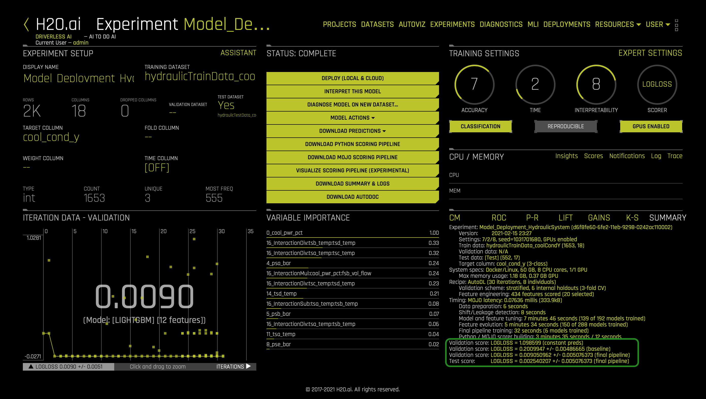

**Figure 13:** Log Loss for Hydraulic System Cooling Condition

We can see the log loss associated with validation and test scores from the Driverless AI experiment dashboard. The **validation score’s log loss** value for the final pipeline is **0.0091**, which means our LightGBM classification model is very close to correctly assigning probabilities for each category, with the highest probability being the actual Hydraulic cooling condition label. The **log loss value for the test score** is lower at **0.0025**, which tells us that our model performed better on the test data than the validation data for classifying the Hydraulic cooling condition. This result is a great indicator that our model would do well with real-world Hydraulic System data. Hydraulic cooling condition is just one of the many parameters to check in Hydraulic Predictive Maintenance.

By looking at the Hydraulic System data and the Hydraulic System Predictive Maintenance labels, we see that we can use our classification model to predict the cooler condition, valve condition, internal pump leakage, hydraulic accumulator bar, and the stable flag. Our predictions can help us decide earlier when to do maintenance on the hydraulic cooler, valve, pump, or accumulator. In the self-paced course, you will be classifying the probability that the hydraulic cooler condition is 3, 20, or 100 using the Log Loss scorer. If the classification is 3, it means the cooler is close to total failure. If it is 20, it means the Hydraulic cooler is operating at reduced efficiency. Lastly, if it is 100, it means the Hydraulic cooler is operating at full efficiency. For example, consider that the actual Hydraulic Cooling Condition is 100, meaning our Hydraulic Cooler operates at full efficiency. Our model predicts the probability of our Hydraulic Cooling Condition being 3 is 0.0013, 20 is 0.0004, and 100 is 0.9982. Our **Log Loss function being low for the test score** at **0.0025** tells us that our scorer is nearly correct in assigning the probability of 99.82% for the Hydraulic Cooler to be 100.  Thus, our scorer’s classification results can reliably help us anticipate when we will need to do maintenance on the Hydraulic cooler.

### Deep Dive and Resources

- [1] [A guide to machine learning algorithms and their applications](https://www.sas.com/en_gb/insights/articles/analytics/machine-learning-algorithms.html)
- [2] [What is the difference between machine learning model and ML algorithm?](https://www.quora.com/What-is-the-difference-between-machine-learning-model-and-ML-algorithm)
- [3] [H2O Use Cases: Using AI to Solve Today’s Challenges](https://www.h2o.ai/solutions/usecases/)
- [4] [Productionizing H2O](http://docs.h2o.ai/h2o/latest-stable/h2o-docs/productionizing.html)
- [5] [Machine Learning - Score](https://docs.microsoft.com/en-us/azure/machine-learning/studio-module-reference/machine-learning-score)
- [6] [Driverless AI: Key Features](http://docs.h2o.ai/driverless-ai/1-8-lts/docs/userguide/key-features.html)
- [7] [Driverless AI: Scoring Pipelines Overview](http://docs.h2o.ai/driverless-ai/1-8-lts/docs/userguide/python-mojo-pipelines.html)
- [8] [Driverless AI MOJO Scoring Pipeline - Java Runtime](http://docs.h2o.ai/driverless-ai/1-8-lts/docs/userguide/scoring-mojo-scoring-pipeline.html)
- [9] [Driverless AI MOJO Scoring Pipeline - C++ Runtime with Python and R Wrappers](http://docs.h2o.ai/driverless-ai/1-8-lts/docs/userguide/scoring-pipeline-cpp.html)
- [10] [Driverless AI Standalone Python Scoring Pipeline](http://docs.h2o.ai/driverless-ai/1-8-lts/docs/userguide/scoring-standalone-python.html)
- [11] [H2Oai GitHub: Driverless AI Deployment Templates](https://github.com/h2oai/dai-deployment-templates)
- [12] [H2Oai YouTube: Lessons Learned from Driverless AI going to Production](https://www.youtube.com/watch?v=zBXXsA1-LOQ)
- [13] [Deploying Models to Maximize the Impact of Machine Learning](https://www.h2o.ai/blog/deploying-models-to-maximise-the-impact-of-machine-learning-part-1/)
- [14] [Four Nines of Availability](https://blog.hike.in/4-9s-b1fc497f3de2)
- [15] [Understanding binary cross-entropy / log loss: a visual explanation](https://towardsdatascience.com/understanding-binary-cross-entropy-log-loss-a-visual-explanation-a3ac6025181a)
- [16] [Log Loss](http://wiki.fast.ai/index.php/Log_Loss)
- [17] [H2O-3: Performance and Prediction: Classification Log Loss](https://docs.h2o.ai/h2o/latest-stable/h2o-docs/performance-and-prediction.html#logloss)
- [18] [Chapter 4. Common Model Parameters: Practical Machine Learning with H2O by Cook](https://learning.oreilly.com/library/view/practical-machine-learning/9781491964590/)
- [19] [Driverless AI MLI Standalone Python Scoring Package](http://docs.h2o.ai/driverless-ai/latest-stable/docs/userguide/scoring-mli-standalone-python.html)
- [20] [MLI Overview](http://docs.h2o.ai/driverless-ai/latest-stable/docs/userguide/interpreting.html)

## Task 3: Batch Scoring via Score Another Dataset

Let’s go through an example of using Driverless AI’s **Predict** in which we will do batch scoring on the data. If you are in production, we don’t recommend using Driverless AI’s **Predict **feature; instead, use a Driverless AI Deployment Template to do batch scoring.

1\. Click **Model Actions** and then select **Predict**.

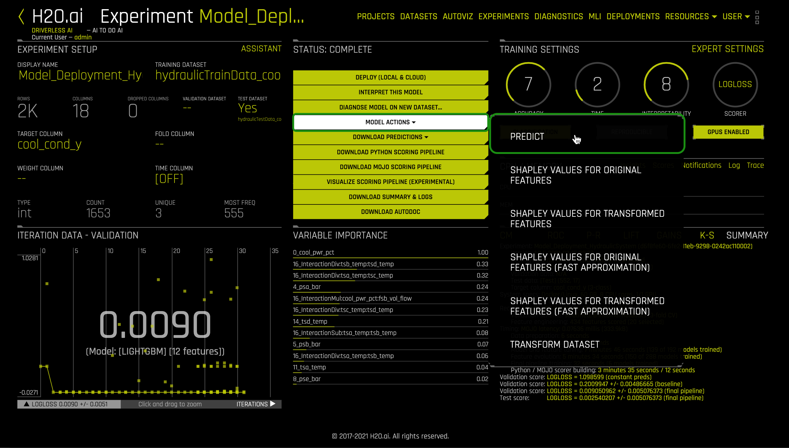

**Figure 14:** Predict Feature

2\. Select the dataset for scoring to be **hydraulicTestData_coolCondY**. Then select the test set column to include in the predictions frame to be **cool_cond_y**, then click Done.

**Figure 15:** Select Test Set Column **cool_cond_y** for Predictions

On the backend, the Python Scoring Pipeline is used to score the data. 

Driverless AI will show pending jobs while your Python Scoring Pipeline is making predictions:

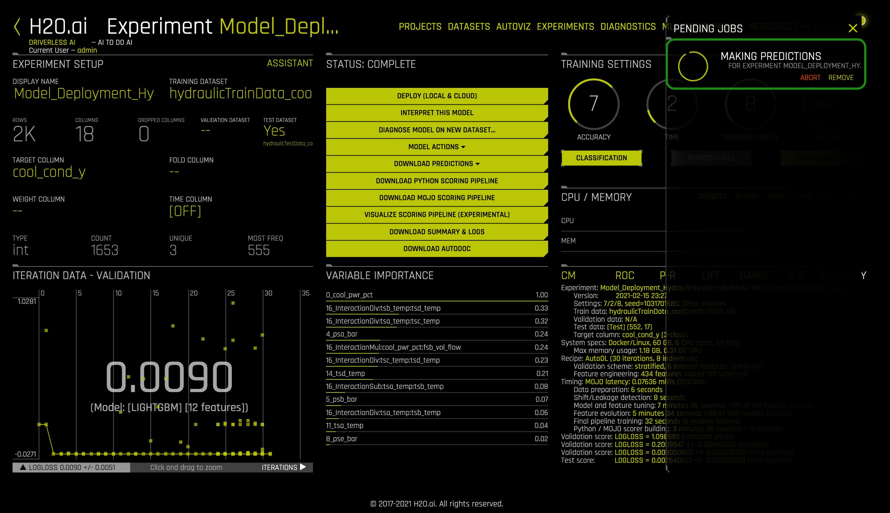

**Figure 16:** Predict Pending Job

Once the pending job is completed, Driverless AI will show a check mark.

3\. Hover over the check mark; it will change to **open**. 

4\. Click on **open** to go to the window where you can download the predictions.

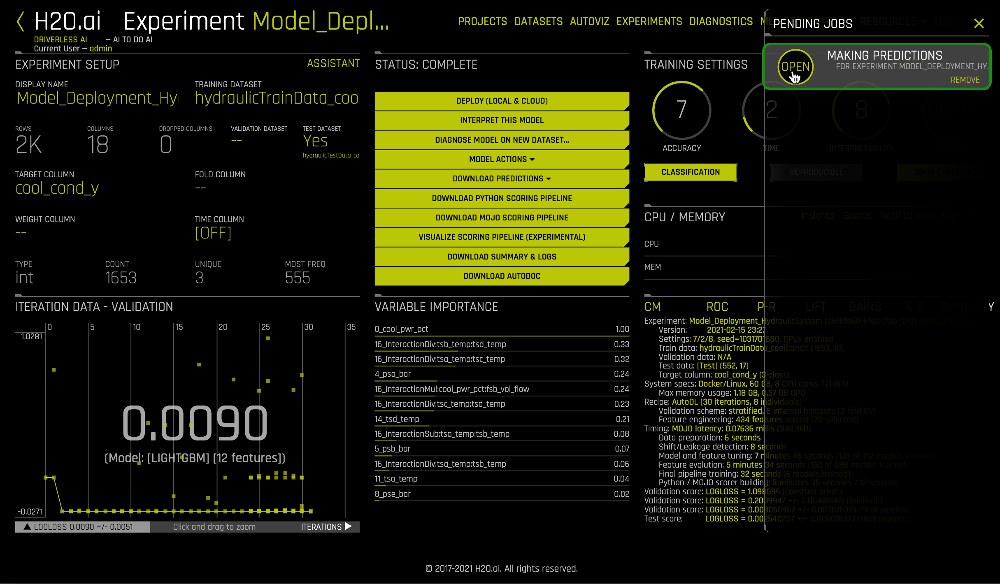

**Figure 17:** Open Download Predictions Page

5\. Once the scoring has finished, the predictions are ready, so click **download predictions**.

**Figure 18:** Download Predictions Button

6\. Import the predictions csv into your favorite spreadsheet. In this self-paced course, we will use Google sheets. Click File, Import, Upload and Select a file from your device.

7\. To make scoring type clear, rename the sheet to **Batch Scoring for Hydraulic Cooling Condition**.

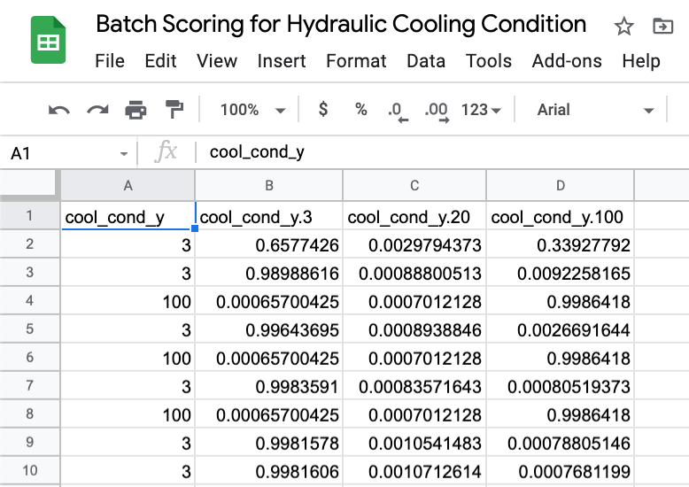

**Figure 19:** Google Sheet with Classifications for Hydraulic Cooling Condition

In the sheet above, we have the batch scores for Hydraulic Cooling Condition. In the first row, we see the actual label followed by the predicted labels. The actual Hydraulic Cooling Condition label is 3. **3** tells us the **Hydraulic Cooler is operating at close to total failure**. Our Python Scoring Pipeline predicts the probability of our Hydraulic Cooling Condition being **3** is **0.65774**, **20** is **0.00298** and **100** is **0.33928**. Therefore, our prediction results tell us the classification model believes there is a **65.774%** chance that the **Hydraulic Cooling Condition is 3**, which means we need to look at doing maintenance right now. Hopefully, as long as we have been doing predictive maintenance up to this point, we already ordered the parts needed to replace the hydraulic cooler, and we can make the replacement today. 

Now that you have practiced executing the Python Scoring Pipeline to score data let’s look at various options for deploying scoring pipelines into production and challenges.

### Deep Dive and Resources

- [Driverless AI Standalone Python Scoring Pipeline](http://docs.h2o.ai/driverless-ai/1-8-lts/docs/userguide/scoring-standalone-python.html)
- [Driverless AI: Score on Another Dataset](http://docs.h2o.ai/driverless-ai/1-8-lts/docs/userguide/score-on-another-dataset.html)

## Task 4: Interactive Scoring (REST) via Deployment Templates

Now that you have some background in scoring pipeline deployment, let’s deploy our MOJO Scoring Pipeline to the REST server.

### Deploy MOJO to REST Server

1\. Click **Deploy (Local & Cloud)**

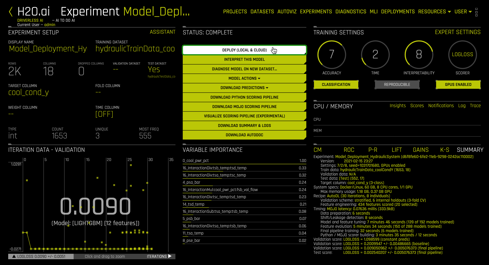

**Figure 20:** Deploy (Local & Cloud) button

2\. Select the **REST server**.

**Figure 21:** Select Deploy Option

3\. Choose an open port number, so change the port number to **9090**.

4\. Click **Deploy**.

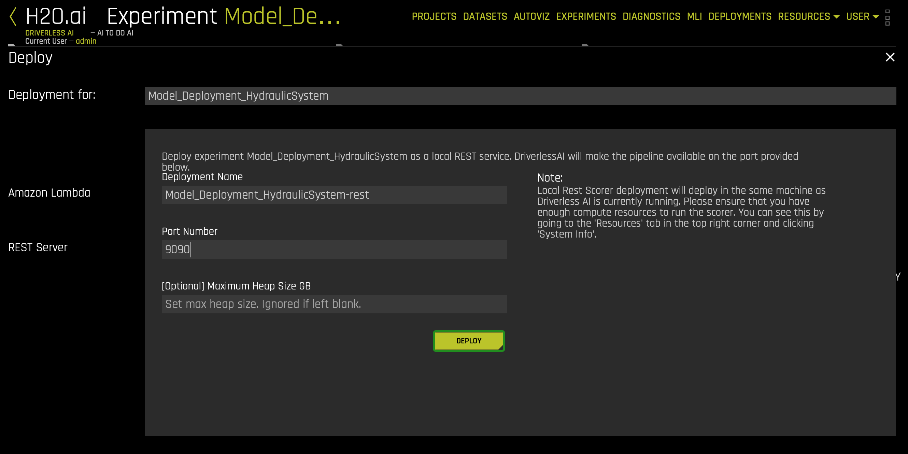

**Figure 22:** Set Rest Server Port & Deploy

**Note**: If you need to check which ports are open, you can ssh into your Driverless AI instance, then use netstat

5\. Your model will be deploying to the REST server.

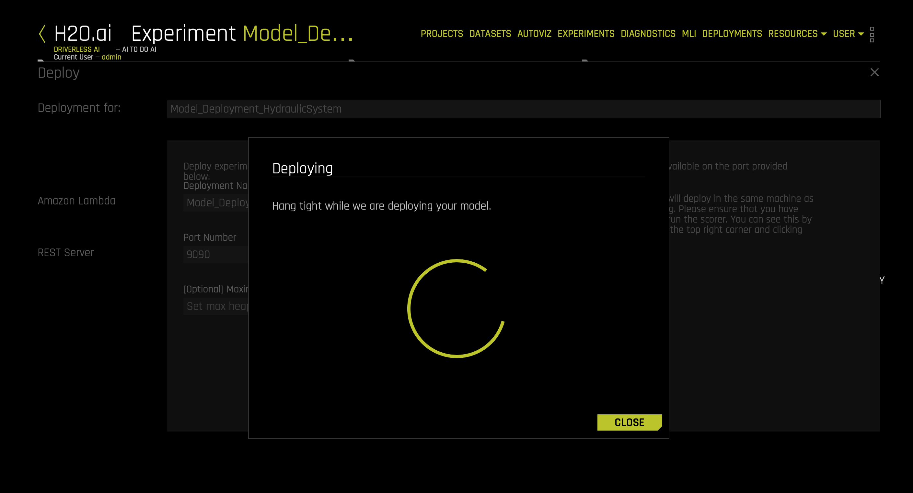

**Figure 23:** Deploying REST Server

**Note**: Behind the scenes, Driverless AI uses the deployment template **local-rest-scorer** to execute the MOJO Scoring Pipeline on the REST server. The local-rest-scorer is powered by **Java Spring Boot** framework. 

Your model has been deployed to the REST server! Driverless AI provides us with a curl command to score data via a JSON request.

6\. Copy the curl command.

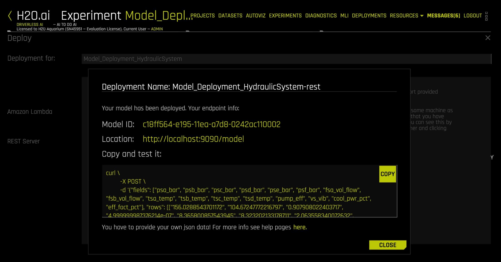

**Figure 24:** Deployed Model to Rest Server

7\. Paste the curl command into your text editor and make some modifications. 

Since the MOJO Scoring Pipeline has been deployed to a REST server on the Driverless AI instance running in the cloud. Copy your instance’s public domain name. For the machine used in this demo, the domain name was changed from http://localhost to http://ec2-52-13-123-150.us-west-2.compute.amazonaws.com as shown below:

~~~bash
# Request REST Server MOJO do interactive scoring for hydraulic cooling condition
curl \
	-X POST \
	-d '{"fields": ["psa_bar", "psb_bar", "psc_bar", "psd_bar", "pse_bar", "psf_bar", "fsa_vol_flow", "fsb_vol_flow", "tsa_temp", "tsb_temp", "tsc_temp", "tsd_temp", "pump_eff", "vs_vib", "cool_pwr_pct", "eff_fact_pct"], "rows": [["155.63356018066406", "104.73638916015625", "1.0683131217956543", "9.200000204145908e-05", "8.365800857543945", "8.322537422180176", "2.063558340072632", "8.871089935302734", "35.319183349609375", "40.97876739501953", "38.31816482543945", "30.479415893554688", "2365.8671875", "0.531166672706604", "1.2421833276748657", "18.2766170501709"]]}' \
	http://ec2-52-13-123-150.us-west-2.compute.amazonaws.com:9090/model/score \
	-H "Content-Type: application/json"
~~~

8\. Copy and paste the modified curl command above to your command line prompt, then run it.

**Figure 25:** Result of Interactive Scoring for Hydraulic Cool Condition via Rest Server

You should receive classification scores for cool_cond_y.3, cool_cond_y.20, cool_cond_y.100. After providing one row of Hydraulic Sensor Test data in the curl command, the Driverless AI MOJO Scoring Pipeline on the REST server computes a classification for **cool_cond_y.3 = 0.3135**, **cool_cond_y.20 = 0.0225**, **cool_cond_y.100 = 0.6641**.

9\. Exit the REST server deployment. 

10\. Click the Close button. The experiment page appears.

### Delete Deployment

Navigate to **Deployments** page.

### Delete REST Server MOJO Deployment

1\. Click on the **Delete** button.

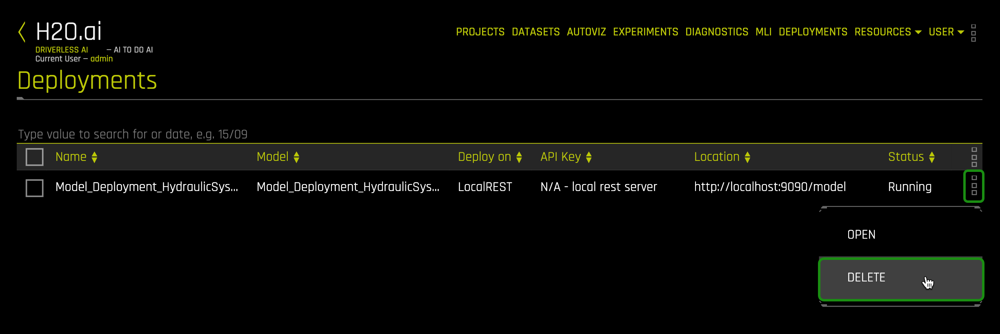

**Figure 26**: Delete REST Server Deployment

2\. Driverless AI will ask you again if you want to permanently delete the REST Server deployment. Click **OK**.

**Figure 27**: Confirm Delete REST Server Deployment

### Deep Dive and Resources

- [Driverless AI: Deploying the MOJO Pipeline](http://docs.h2o.ai/driverless-ai/1-8-lts/docs/userguide/deployment.html)

## Task 5: Challenge

### Deploy Scoring Pipeline for a New Dataset

There are various challenges you could take on. You could do something that helps you in your daily life or job. Maybe there is a dataset you are working with, you could reproduce the steps we did above, but for your dataset, build a new experiment and deploy your MOJO scoring pipeline to a local REST server or Amazon Lambda.

### Integrate Scoring Pipeline into Program

Another challenge could be to use the existing MOJO Scoring Pipeline we deployed and instead of using curl command to score data, integrate the scoring into a Java, Python, R, C++, etc,. program using an HTTP client.

### Deploy Scoring Pipeline using Java Deployment Templates

Alternatively, you could use the Driverless AI Java Deployment Templates to deploy the MOJO Scoring Pipeline to various production environments. Currently, there is support for MOJO deployment to a local REST server, Amazon Lambda, Amazon Sagemaker, Google Cloud Run, SQL database. Also if there is not a deployment template to the production environment that you need, you could create a new deployment template and contribute it back to the open source.

## Next Steps 

- Check out Driverless AI's next Scoring Pipeline Deployment self-paced course where you will learn how to deploy MOJO Scoring Pipelines using Production Ready Deployment Templates:
  - [Self-Paced Course 4B: Scoring Pipeline Deployment Templates](https://training.h2o.ai/products/self-paced-course-4b-scoring-pipeline-deployment-templates)

- Check out these webinars that dive into how to productionize H2O Models:
  - H2O Webinar: [Introduction to Sparkling Water: Productionizing H2O Models with Apache Spark by Edgar Orendain](https://www.h2o.ai/webinars/)
  - H2O Webinar: [Productionizing H2O Driverless AI Models by Nicholas Png](https://www.h2o.ai/webinars/)

- Check out this article on deploying H2O Driverless AI Model to Alteryx
  - Alteryx Community: [Deploy H2O Driverless AI MOJO to Alteryx Promote by Timothy Lam](https://community.alteryx.com/t5/Data-Science-Blog/Deploy-H2O-Driverless-AI-MOJO-to-Alteryx-Promote/ba-p/489190)

- Check out this article on a Solution Architect & Business Data Scientist's perspective on using Driverless AI for Automatic Machine Learning:
  - Medium: [Data to AI/ML Production Pipeline code in a few clicks! By Karthik Guruswamy](https://medium.com/@kguruswamy_37814/blink-data-to-ai-ml-production-pipeline-code-in-a-few-clicks-99a1a45440a9)

## Appendix A: Build Driverless AI Experiment

For users who are interested in building the experiment from scratch and also possibly obtaining a better validation score for the final pipeline than the prebuilt experiment, we are going to walk through the steps to do so.

Also if you are interested in installing Driverless AI on the cloud, check out one of the following guides on how to do that:

- [Install Driverless AI on AWS](http://docs.h2o.ai/driverless-ai/latest-stable/docs/userguide/install/aws.html)
- [Install Driverless AI on Azure](http://docs.h2o.ai/driverless-ai/latest-stable/docs/userguide/install/azure.html)
- [Install Driverless AI on Google](http://docs.h2o.ai/driverless-ai/latest-stable/docs/userguide/install/google-compute.html)

Feel free to follow along with Driverless AI aquarium instance or one of the Driverless AI instance you installed on one of the cloud services above.

1\. Open Driverless AI at `<ec2-public-dns>:12345/login`

**Figure 28**: Driverless AI Login

**Note:** If you are running Driverless AI on Aquarium, you won't need to enter login credentials, or a license key.

- The login is username `h2oai` and password `<InstanceID>`

2\. Enter your Driverless AI License Key that you purchased with Driverless AI.

**Figure 29**: Enter Driverless AI License Key

- Once the License Key is entered, we can start using Driverless AI.

3\. Upload the Hydraulic System Condition Monitoring Dataset by using **Data Recipe URL**

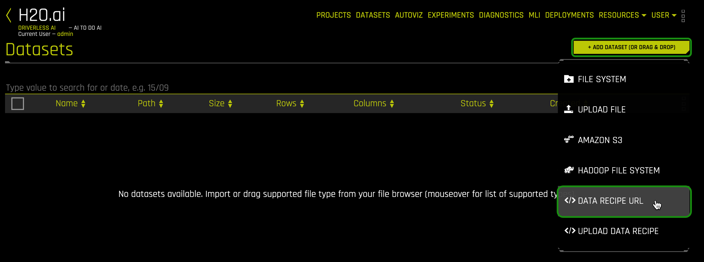

**Figure 30:** Open Add Dataset Menu for Selecting Data Recipe URL

**Note:** If you installed Driverless AI on cloud, you will notice more add dataset options than Driverless AI on aquarium.

4\. Copy and paste the following **Data Recipe URL**, then click **save**:

~~~bash
# Data Recipe URL:
https://raw.githubusercontent.com/james94/driverlessai-recipes/master/data/hydraulic-data.py
~~~

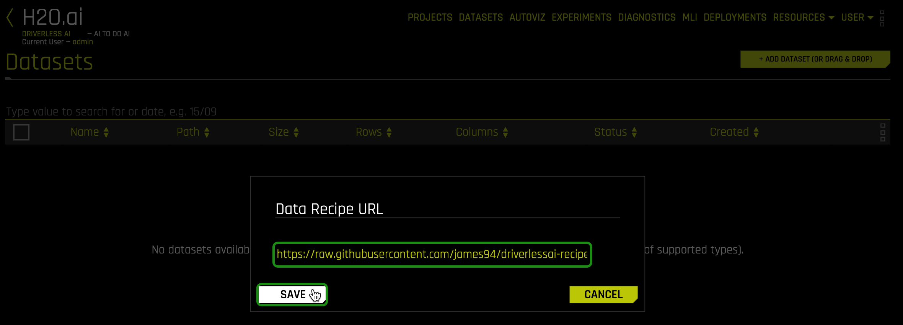

**Figure 31:** Insert Data Recipe URL

The **Data Recipe Python script** was called from the URL to preprocess the Hydraulic System Condition Monitoring data from the UCI source and import it into Driverless AI. You should see the **hydCondMonitorData.csv** available for use now.

**Figure 32:** Imported Hydraulic System Data via Data Recipe

3\. Split the data with **75%** for training called **hydraulicTrainData_coolCondY** and **25%** for testing called **hydraulicTestData_coolCondY**.

4\. Select target column **cool_cond_y**.

5\. Click **save**.

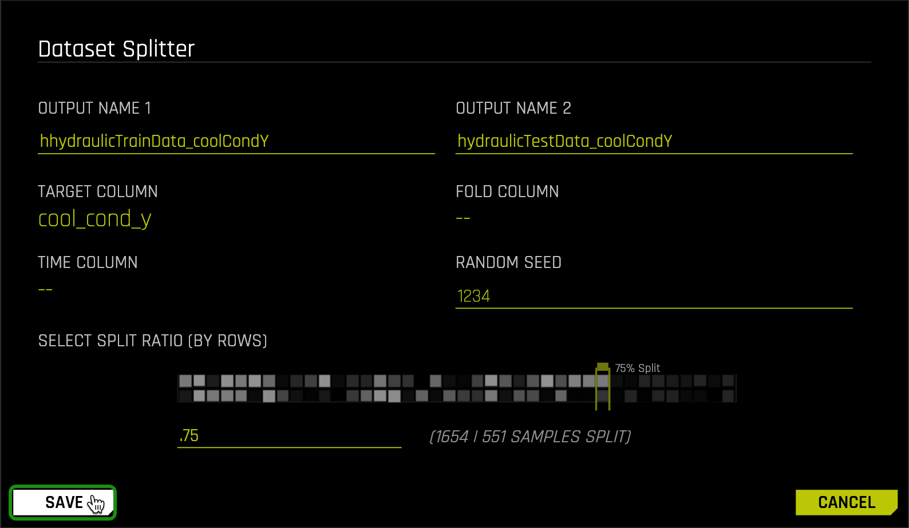

**Figure 33:** Dataset Splitter for Hydraulic System Data

The data set finished splitting into train and test data.

**Figure 34:** Split Hydraulic Data into Training and Testing Set

6\. Click on the **hydraulicTrainData_coolCondY**, select **Predict**. 

7\. Name the Experiment **Model_Deployment_HydraulicSystem**.

8\. Choose the target column **cool_cond_y** for scoring. 

9\. Choose the test data **hydraulicTestData_coolCondY**

10\. Set **TIME = 5** and **INTERPRETABILITY = 6**

11\. Click **Expert Settings**. Type **auc** in the search. Set the following features to:

- Max allowed feature shift (AUC) before dropping feature = 0.991
- Leakage detection dropping AUC/R2 threshold = 0.991

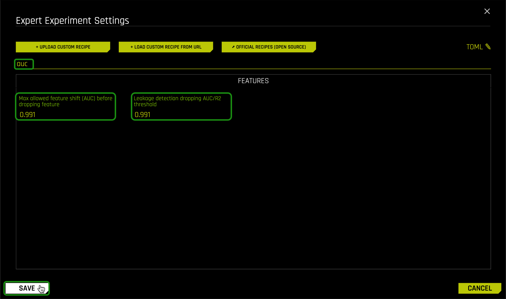

**Figure 35:** Configure AUC related features in Expert Settings

12\. Click **Launch Experiment**. It may take about **1 hour 30 minutes** or longer to complete.

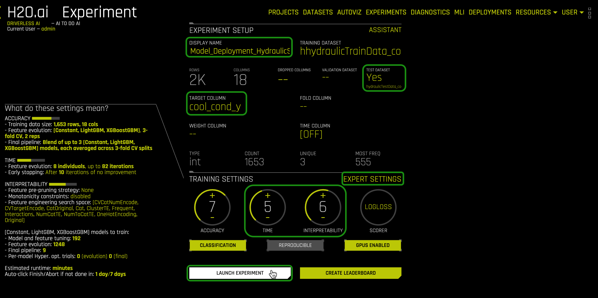

**Figure 36:** Configure Experiment Before Launching

As the experiment is building, you will notice notifications. Driverless AI notifies us that there is possible leakage in training data for certain features. Driverless AI recommends we should consider dropping leaky features. So, if we are not satisfied with the results after the build finishes, we could look at dropping some leaky features that have high AUC values close to 1, but keep results that are equal to or less than 0.991 and build a new experiment.

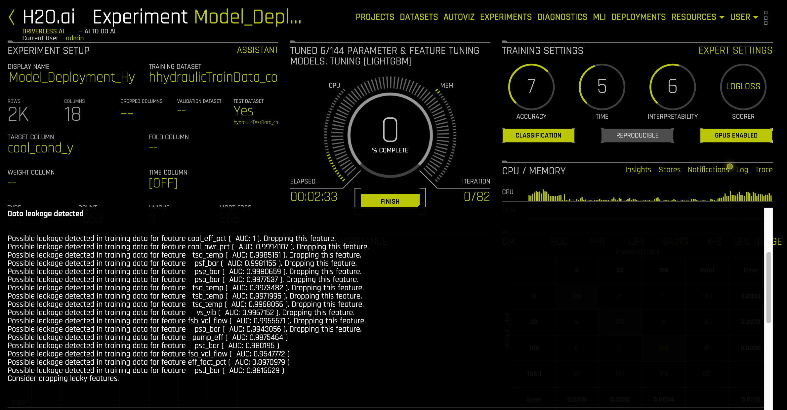

**Figure 37**: Configure Experiment Before Launching

You’ll notice Driverless AI chose **Log Loss** to be the winning **scorer** based on our training data. This is because we are dealing with a classification of what the hydraulic cooling condition could be, which is 3, 20, or 100. If our scorer classifies our hydraulic system test data as a cooling condition 3, then that means our cooler is close to total failure. If the scorer classification is 20, then our cooler is operating at reduced efficiency. If the scorer classification is 100, then our cooler is operating at full efficiency.

**Figure 38:** Launched Driverless AI Experiment

What happened as a result of launching this new experiment-related model deployment? In the **iteration data - validation** chart, you can see that the **validation score for the final pipeline in this new experiment is at 0.0435** while the **validation score for the final pipeline in the prebuilt experiment was 0.0090**. The lower the validation score, the better the model is at classifying for Hydraulic Cooling Condition.

### Deep Dive and Resources

- [Driverless AI Docs: Experiment](http://docs.h2o.ai/driverless-ai/latest-stable/docs/userguide/running-experiment.html)
- [Driverless AI Docs: Project Workspace](http://docs.h2o.ai/driverless-ai/latest-stable/docs/userguide/projects.html)
- GitHub Repo: [Driverless AI Recipes](https://github.com/h2oai/driverlessai-recipes)

## Appendix B: Interactive Scoring (AWS Lambda) via Deployment Templates

**Note:** In this appendix, we will show you an example of how to do the Lambda deployment, but since you need several permissions, you won't be able to do it on Aquarium.

### Deploy MOJO to Amazon Lambda

1\. Click **Deploy (Local & Cloud)**. 

2\. Select **Amazon Lambda**.

3\. Rename Deployment Name to be **model-hydraulic-lambda**.

**Note**: S3 bucket names can only be lowercase and can't have underscores. [See the naming requirements for Amazon S3 buckets](https://docs.aws.amazon.com/awscloudtrail/latest/userguide/cloudtrail-s3-bucket-naming-requirements.html).

4\. Add your **IAM Access Key ID**, **AWS Secret Access Key**, and **Region**.

5\. Click **Deploy**.

**Figure 39:** Set AWS Lambda Model Deployment Fields

Driverless AI will create an s3 bucket called **model-hydraulic-lambda**; save the MOJO Scoring Pipeline file in the s3 bucket, create an AWS Lambda function called **h2oai-model-hydraulic-lambda** in the us-west-1 region.

**Note:** To get your IAM access key and secret key, login to your AWS IAM account, go to your Identity and Access Management (IAM) service. Go to Users, search for your particular user, click it, and select Security Credentials; then, create an access key.

**Figure 40:** AWS Create IAM Access Key

Your model will be deployed to the Amazon Lambda function.

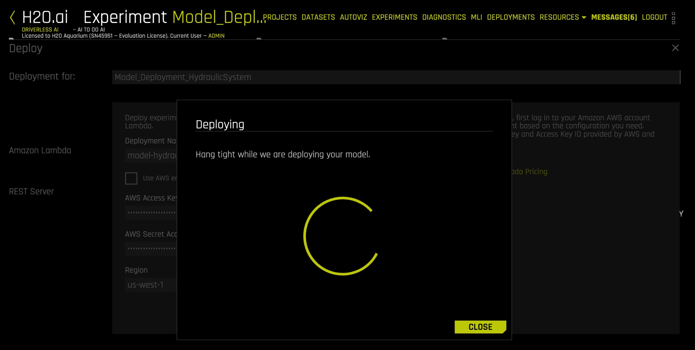

**Figure 41:** Deploying Model to AWS Lambda

**Note:** Behind the scenes, Driverless AI uses the deployment template **aws-lambda-scorer** to execute the MOJO Scoring Pipeline on the Amazon Lambda function. The aws-lambda-scorer is powered by AWS API Gateway with Lambda proxy integration and Terraform recipe. 

Your model has been deployed to the serverless Amazon Lambda function! Driverless AI provides us with a curl command to score data via a JSON request. 

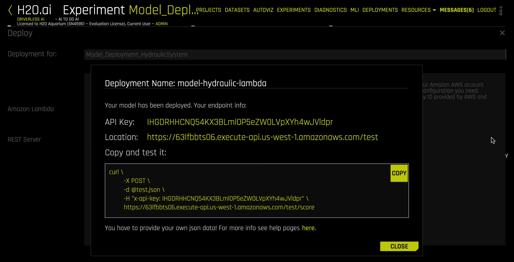

**Figure 42:** Deployed Model to AWS Lambda

Notice the curl command for the Amazon Lambda has a **test.json** file as an argument. We do not have that file, so we need to create it. 

6\. Let’s leverage our one row of Hydraulic Sensor Test data from earlier and store it into our new **test.json** file. Save it.

~~~json
{
   "fields": ["psa_bar", "psb_bar", "psc_bar", "psd_bar", "pse_bar", "psf_bar", "fsa_vol_flow", "fsb_vol_flow", "tsa_temp", "tsb_temp", "tsc_temp", "tsd_temp", "pump_eff", "vs_vib", "cool_pwr_pct", "eff_fact_pct"],
   "rows": [["155.56646728515625", "104.93318176269531", "0.862698495388031", "0.00021100000594742596", "8.37287425994873", "8.321526527404785", "2.0819649696350098", "8.871089935302734", "35.355934143066406", "40.99454879760742", "38.31908416748047", "30.47344970703125", "2366.707275390625", "0.5243666768074036", "1.3755667209625244", "19.58085060119629"]]
}
~~~

7\. Copy and paste the Amazon Lambda curl command to your command line prompt, then run it.

~~~bash
# Request AWS Lambda MOJO do interactive scoring for hydraulic cooling condition
curl \
   -X POST \
   -d @test.json \
   -H "x-api-key: m4U7PcaQ9n4wZZqo3xmz69nEJf5BLPFm5F2OrZdV" \
   https://63lfbbts06.execute-api.us-west-1.amazonaws.com/test/score
~~~

**Figure 43:** Result of Interactive Scoring for Hydraulic Cool Condition via AWS Lambda

You should receive classification scores for cool_cond_y.3, cool_cond_y.20, cool_cond_y.100. After providing one row of Hydraulic Sensor Test data in the curl command, the Driverless AI MOJO scoring pipeline on Amazon Lambda computes a classification for **cool_cond_y.3 = 0.2838**, **cool_cond_y.20 = 0.1479**, **cool_cond_y.100 = 0.5683**.

8\. Click the **Close** button. Then click **X**. The experiment page appears.

### Delete Amazon Lambda MOJO Deployment

If you no longer need your MOJO deployed to Amazon Lambda and are concerned about cleaning up the remaining components on AWS, Driverless AI makes cleaning up very easy.

We delete our MOJO deployment to Amazon Lambda in Driverless AI Deployments and Driverless AI will clean up any remaining components on AWS related to our deployment for us.

1\. Click on the **Delete** button.

**Figure 44:** Open Menu to Delete AWS Lambda Model Deployment

2\. Driverless AI will ask you again if you want to permanently delete the Amazon Lambda deployment. Click **OK**.

**Figure 45:** Confirm AWS Lambda Model Deployment for Deletion

Driverless AI will quickly show the Amazon Lambda deployment being destroyed.

## Appendix C: AI Glossary

Refer to [H2O.ai Community AI Glossary](https://www.h2o.ai/community/browse/ai-glossary-search) for relevant Model Deployment Terms.
